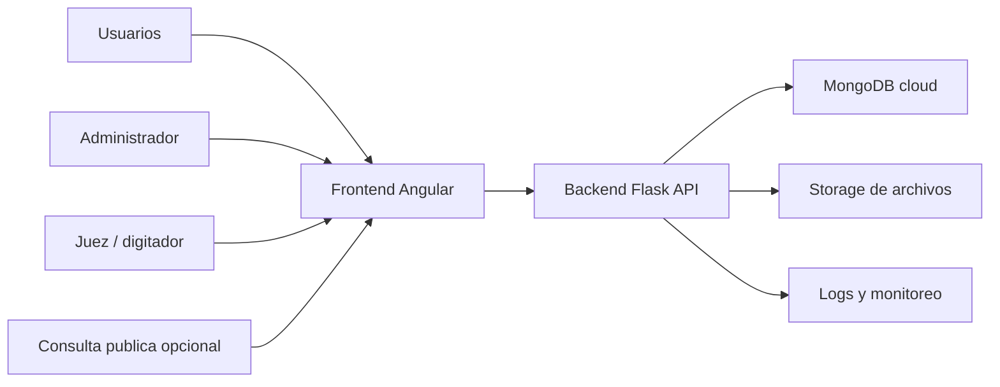

# Plan de migracion online - Ritmica Chile

## 1. Diagnostico tecnico actual

### Estado del sistema

El proyecto ya tiene una base apta para una migracion online:

- Frontend: Angular 17 con Angular Material.
- Backend: Flask 3 en Python.
- Base de datos: MongoDB usando `pymongo`.
- Archivos: carga de orden de paso desde Excel y exportacion a Excel/PDF.
- Despliegue local: Docker Compose con servicios `frontend`, `backend` y `mongo`.

### Hallazgos relevantes

- La API ya esta separada del frontend, lo que facilita publicarla online.
- Los campeonatos se guardan como bases de datos MongoDB independientes con prefijo `campeonato_`.
- Cada categoria se guarda como una coleccion dinamica dentro de la base del campeonato.
- No hay autenticacion ni roles de usuarios.
- No hay autorizacion por endpoint.
- La URL de API estaba fija en el frontend como `http://localhost:8080`; esto ya fue corregido para usar `environment.apiUrl`.
- Los ambientes `environment.ts` y `environment.prod.ts` ahora controlan el servicio API principal.
- CORS esta pensado para desarrollo local.
- `FLASK_DEBUG` quedaba en `True` por defecto; ahora queda en `False` salvo que se habilite por variable de entorno.
- La documentacion del backend esta desactualizada respecto del modelo nuevo de bancas y jornadas.
- La carga de archivos se limita a Excel, pero falta validacion mas estricta de extension, MIME, tamano, contenido y auditoria.

### Riesgos para publicar online

1. Cualquier persona que conozca la URL podria crear, editar o exportar campeonatos.
2. No existe control de permisos entre administradores, jueces y consulta publica.
3. El modelo de base dinamica por campeonato funciona, pero puede complicar reportes globales, backups granulares y administracion multiusuario.
4. Usar nombres como llave de gimnastas puede generar colisiones si hay nombres repetidos dentro de una categoria.
5. El frontend no esta preparado para cambiar de API por ambiente sin modificar codigo.
6. La configuracion actual esta enfocada en red local, no en produccion con dominio, HTTPS, secretos y monitoreo.

## 2. Arquitectura objetivo recomendada

### Opcion recomendada para primera version online

Mantener la arquitectura actual, endurecida para produccion:

- Frontend Angular publicado como sitio estatico.
- Backend Flask publicado como API privada/publica bajo HTTPS.
- MongoDB administrado en la nube.
- Almacenamiento de archivos opcional para respaldar Excel originales y exportaciones.
- Autenticacion con JWT o sesiones seguras.
- Variables de entorno por ambiente.
- Backups automaticos de base de datos.

### Diagrama logico

### Plataformas sugeridas

#### Alternativa simple y economica

- Frontend: Vercel, Netlify o Cloudflare Pages.
- Backend: Render, Railway o Fly.io.
- Base de datos: MongoDB Atlas.
- Archivos: Cloudinary, S3 compatible o almacenamiento del proveedor.

#### Alternativa mas integrada

- Frontend y backend en Render/Railway.
- MongoDB Atlas.
- Dominio propio con Cloudflare.

#### Alternativa corporativa

- AWS, Azure o Google Cloud.
- MongoDB Atlas o base administrada equivalente.
- S3 para archivos.
- CloudWatch/Application Insights para logs.

## 3. Diseno de base de datos

### Evaluacion del modelo actual

Modelo actual:

- Una base MongoDB por campeonato.
- Coleccion `metadata`.
- Coleccion `jueces`.
- Una coleccion por categoria.

Ventajas:

- Simple para aislar campeonatos.
- Facil de entender en operacion local.
- Encaja con la estructura actual del codigo.

Desventajas:

- Dificulta consultas globales.
- Dificulta permisos por organizacion o club.
- Dificulta reportes historicos.
- Crea colecciones dinamicas que requieren mas cuidado en validacion.

### Modelo recomendado para MVP

Para migrar rapido y con bajo riesgo:

- Mantener MongoDB.
- Mantener compatibilidad con la estructura actual.
- Agregar colecciones globales de administracion en una base principal.

Base principal sugerida: `ritmica_chile`

Colecciones:

- `users`: usuarios del sistema.
- `organizations`: federacion, clubes o entidades, si aplica.
- `championship_index`: indice global de campeonatos.
- `audit_logs`: historial de acciones relevantes.
- `file_uploads`: trazabilidad de archivos cargados.

Bases por campeonato:

- `metadata`
- `jueces`
- colecciones de categorias, como hoy

### Modelo recomendado para version 2

Migrar gradualmente hacia una base unica con colecciones normalizadas:

- `championships`
- `categories`
- `gymnasts`
- `judges`
- `scores`
- `exports`
- `audit_logs`

Esta version facilita estadisticas, historial, busquedas globales y control fino de permisos.

## 4. Seguridad

### Requerimientos minimos antes de publicar

1. Autenticacion obligatoria para crear, editar, cargar Excel y exportar resultados internos.
2. Passwords con hash seguro usando `bcrypt` o `argon2`.
3. Roles de usuario.
4. Proteccion por endpoint en backend.
5. CORS limitado al dominio real.
6. `FLASK_DEBUG=False` en produccion.
7. Variables secretas fuera del codigo.
8. HTTPS obligatorio.
9. Limite de tamano y tipo para archivos subidos.
10. Logs de acciones criticas.
11. Backups automaticos.

### Roles sugeridos

- `super_admin`: administra todo el sistema.
- `admin_campeonato`: crea campeonatos, jueces, categorias y exportaciones.
- `digitador`: ingresa o corrige puntajes.
- `visor`: consulta resultados sin editar.
- `publico`: acceso opcional solo a resultados publicados.

### Permisos iniciales

| Accion | super_admin | admin_campeonato | digitador | visor | publico |
|---|---:|---:|---:|---:|---:|
| Crear campeonato | Si | Si | No | No | No |
| Editar jueces | Si | Si | No | No | No |
| Subir Excel | Si | Si | No | No | No |
| Ingresar puntajes | Si | Si | Si | No | No |
| Exportar resultados | Si | Si | Si | Si | No |
| Ver resultados publicados | Si | Si | Si | Si | Si |
| Administrar usuarios | Si | No | No | No | No |

## 5. Funcionalidades MVP online

### MVP obligatorio

1. Login.
2. Logout.
3. Usuarios y roles.
4. Configuracion de API por ambiente.
5. Proteccion de rutas Angular.
6. Proteccion de endpoints Flask.
7. Crear campeonato.
8. Registrar jueces por banca y jornada.
9. Subir Excel de orden de paso.
10. Ingresar puntajes.
11. Guardar puntajes en MongoDB cloud.
12. Exportar Excel/PDF.
13. Listar campeonatos disponibles segun permisos.
14. Backups automaticos.

### MVP deseable

1. Panel de administracion de usuarios.
2. Publicar/despublicar resultados.
3. Auditoria basica: quien creo, edito, cargo archivo o exporto.
4. Registro del archivo Excel original.
5. Pantalla de estado del sistema.

### Fuera del MVP

- Notificaciones por correo.
- Estadisticas historicas avanzadas.
- Integracion con pagos.
- App movil nativa.
- Firma digital de resultados.
- Transmision publica en vivo con ranking automatico.

## 6. Etapas de trabajo

### Etapa 0 - Preparacion tecnica

Objetivo: dejar el proyecto listo para trabajar por ambientes.

Tareas:

- Usar `environment.apiUrl` en `ApiService`. Listo.
- Crear configuracion de backend para desarrollo, staging y produccion.
- Desactivar debug por defecto en produccion. Listo.
- Revisar Dockerfiles para produccion.
- Actualizar README tecnico.

Entregable:

- App local funcionando igual, pero configurable para online.

### Etapa 1 - Arquitectura cloud y ambientes

Objetivo: crear infraestructura base.

Tareas:

- Elegir proveedor.
- Crear MongoDB cloud.
- Crear backend en ambiente staging.
- Crear frontend en ambiente staging.
- Configurar CORS para staging.
- Configurar variables de entorno.
- Configurar dominio temporal.

Entregable:

- Sistema accesible online en staging sin datos reales sensibles.

### Etapa 2 - Autenticacion y roles

Objetivo: impedir acceso anonimo a funciones privadas.

Tareas:

- Crear modelo `users`.
- Crear login backend.
- Implementar hash de password.
- Implementar JWT o cookie de sesion segura.
- Agregar guards en Angular.
- Proteger endpoints Flask.
- Crear usuario administrador inicial.

Entregable:

- Solo usuarios autenticados pueden operar campeonatos.

### Etapa 3 - Seguridad operativa

Objetivo: endurecer el sistema antes de uso real.

Tareas:

- Limitar CORS a dominios permitidos.
- Validar payloads de endpoints.
- Validar Excel por extension, MIME, tamano y estructura.
- Agregar rate limiting en login y endpoints sensibles.
- Agregar logs de acciones criticas.
- Configurar backups.
- Configurar manejo de errores sin trazas visibles al usuario.

Entregable:

- Checklist de seguridad MVP cumplido.

### Etapa 4 - Migracion de datos

Objetivo: mover campeonatos existentes o preparar importacion limpia.

Tareas:

- Inventariar bases y archivos actuales.
- Definir si se migran campeonatos historicos o solo plantillas.
- Crear script de export/import MongoDB.
- Validar integridad de categorias, gimnastas, jueces y puntajes.
- Probar restauracion desde backup.

Entregable:

- Datos disponibles en MongoDB cloud y verificados.

### Etapa 5 - Funcionalidades online principales

Objetivo: completar flujo operativo online.

Tareas:

- Listar campeonatos por usuario/rol.
- Crear y editar campeonatos.
- Cargar orden de paso.
- Ingresar puntajes.
- Guardar y recalcular en backend.
- Exportar Excel/PDF.
- Publicar resultados si se decide incluir vista publica.

Entregable:

- MVP operativo para un campeonato real.

### Etapa 6 - Pruebas y salida a produccion

Objetivo: publicar con confianza.

Tareas:

- Pruebas funcionales de campeonato completo.
- Pruebas con distintos roles.
- Pruebas de subida de Excel valido/invalido.
- Pruebas de exportacion.
- Pruebas en escritorio, tablet y celular.
- Prueba de backup y restauracion.
- Configurar dominio definitivo y HTTPS.

Entregable:

- Sistema online en produccion.

## 7. Cambios tecnicos iniciales recomendados

### Frontend

- Cambiar `ApiService` para usar `environment.apiUrl`.
- Crear `AuthService`.
- Crear `LoginComponent`.
- Crear `AuthGuard`.
- Agregar interceptor HTTP para token o sesion.
- Agregar manejo centralizado de errores 401/403.

### Backend

- Agregar dependencias: `Flask-JWT-Extended` o alternativa de sesiones, `passlib[bcrypt]` o `argon2-cffi`, `Flask-Limiter`, `pydantic` o validadores equivalentes.
- Crear modulo `auth`.
- Crear decoradores de permisos.
- Agregar coleccion global `users`.
- Agregar coleccion global `audit_logs`.
- Agregar configuracion por ambiente.
- Normalizar respuestas de error.

### Base de datos

- Crear base principal `ritmica_chile`.
- Crear indices:
  - `users.email` unico.
  - `championship_index.slug` unico.
  - `audit_logs.created_at`.
  - `audit_logs.user_id`.
- Mantener bases de campeonato durante el MVP.

## 8. Orden sugerido de implementacion inmediata

1. Corregir configuracion de API por ambiente. Listo.
2. Preparar backend para produccion: debug, CORS y variables. Parcial: debug listo; CORS y variables por ambiente siguen pendientes.
3. Agregar autenticacion y roles.
4. Proteger rutas y endpoints.
5. Crear ambiente staging online.
6. Migrar MongoDB a Atlas.
7. Probar flujo completo con datos de ejemplo.
8. Agregar auditoria y backups.
9. Publicar produccion.

## 9. Criterios de aceptacion del MVP

- El sistema abre desde un dominio HTTPS.
- Un usuario anonimo no puede crear ni modificar campeonatos.
- Un administrador puede crear campeonato, jueces, subir Excel y exportar.
- Un digitador puede ingresar puntajes, pero no administrar usuarios.
- Los datos quedan guardados en base cloud.
- El sistema funciona sin depender de `localhost`.
- Hay backup automatico activo.
- Hay al menos un log de acciones criticas.
- La configuracion sensible no esta en el repositorio.

## 10. Decision pendiente

Antes de implementar el MVP online completo hay que decidir:

1. Proveedor de hosting.
2. Dominio o subdominio.
3. Si los resultados tendran vista publica.
4. Si se migran campeonatos historicos o se parte con campeonatos nuevos.
5. Si el modelo de datos se mantiene compatible para MVP o se rediseña de inmediato.

Recomendacion: mantener compatibilidad para el MVP, publicar rapido en staging y redisenar el modelo de datos en una segunda fase cuando el flujo online ya este validado.
